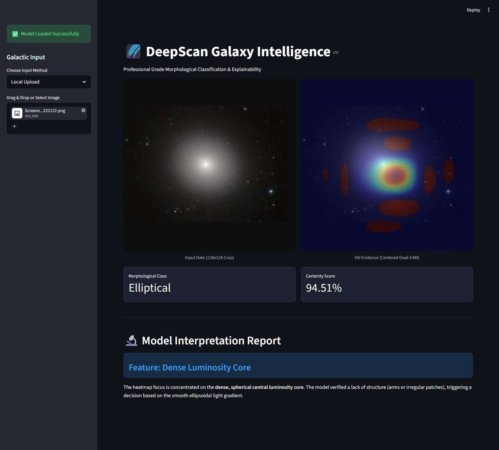
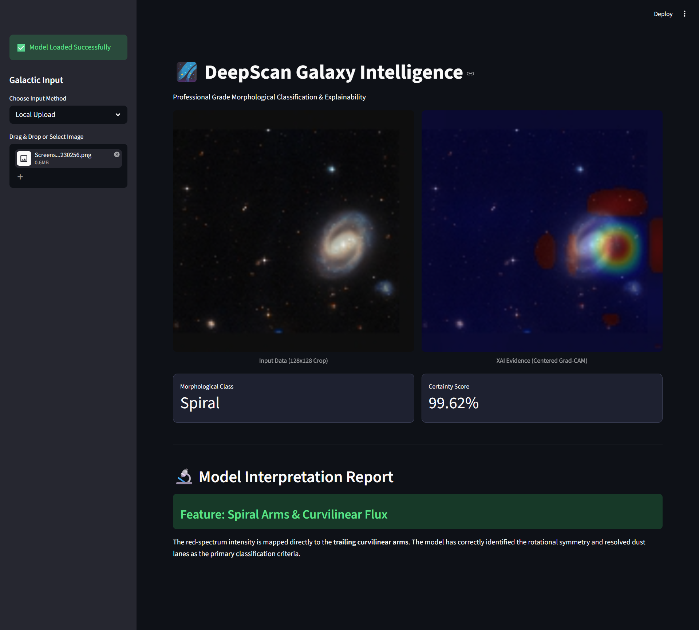
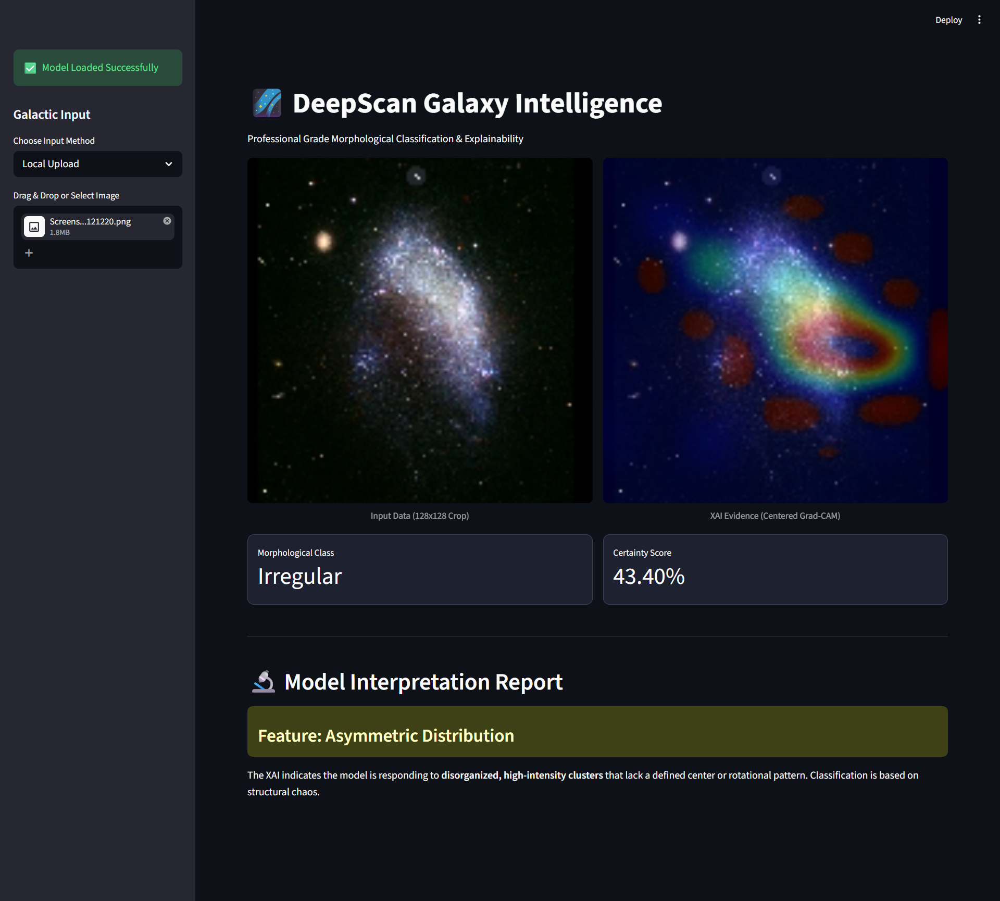

# 🌌 Explainable AI (XAI) in Deep Learning Models for Large-Scale Galaxy Classification



Welcome to the **DeepScan Galaxy Intelligence** project! This repository contains a deep learning-based application that classifies the morphological structures of galaxies into three primary categories: **Elliptical**, **Spiral**, and **Irregular**. 

But we don't just stop at giving you a prediction. To build trust and transparency, this project uses **Explainable AI (XAI)**, specifically Grad-CAM, to visually demonstrate *why* the model made a specific classification.

---

## 🚀 The Journey: From Cloud to Local

This project was built with a two-step philosophy: train heavy in the cloud, deploy light locally.

1. **Heavy Lifting in Kaggle**: 
   The core deep learning model (a convolutional neural network) was developed and trained entirely in a **Kaggle Jupyter Notebook**. To handle the computational load of training, we utilized **2x T4 GPUs**. The final model was trained, validated, and saved as a `.h5` file on Kaggle.

2. **Local Deployment with Streamlit**:
   The trained model was then downloaded to a local VS Code environment. We built a beautiful, professional-grade UI using **Streamlit**. The best part? The inference and XAI visualizations run completely locally, using **only CPUs**. 

---

## 📊 Current Performance & Future Roadmap

**Current Accuracy: 85%** 🎯

Our model currently achieves an impressive 85% accuracy on the test dataset. It's highly capable of identifying distinguishing features such as spiral arms, dense luminosity cores, and asymmetric distributions.

**What's Next? (The Future is High-Res)**
While 85% is a strong start, our vision is to push this even further. In future iterations, we plan to:
- **Train on actual high-resolution images:** The current preprocessing resizes images to 128x128. Training on higher resolutions will allow the model to perform much finer feature detection, picking up on subtle galactic dust lanes and fainter structures.
- **Improve Accuracy:** By leveraging higher-resolution data and fine-tuning our architecture, we aim to break past the 90%+ accuracy threshold.

---

## 🖼️ Application Showcases

Here are some snapshots of the application running locally:

### Spiral Galaxy Analysis
The model accurately identifies spiral galaxies by mapping red-spectrum intensity to the trailing curvilinear arms.


### Model Interpretation in Action
Our XAI highlights exactly where the model is looking—whether it's the dense core of an elliptical galaxy or the chaotic clusters of an irregular one.


---

## 🛠️ How to Run This Locally

1. **Clone the repository:**
   ```bash
   git clone https://github.com/ushnardra/Explainable-AI-XAI-in-Deep-Learning-Models-for-Large-Scale-Galaxy-Classification.git
   cd Explainable-AI-XAI-in-Deep-Learning-Models-for-Large-Scale-Galaxy-Classification
   ```

2. **Install the requirements:**
   Make sure you have Python installed, then set up your environment:
   ```bash
   pip install streamlit tensorflow opencv-python-headless numpy pillow requests
   ```
   *(Note: The `app.py` script includes GPU memory growth configurations, but runs perfectly on CPU as well).*

3. **Add the Model:**
   Ensure the trained `galaxy_model.h5` is placed inside the `model/` directory.

4. **Run the Streamlit App:**
   ```bash
   streamlit run app.py
   ```

5. **Explore:** Open your browser to `http://localhost:8501` and start uploading galaxy images!

---

## 🧠 Under the Hood (The XAI Magic)
The application utilizes a refined **Grad-CAM** algorithm. By tapping into the final convolutional layer of our model (`conv4_block6_out`), we extract gradients and generate a heat map. This heat map is then superimposed over the original image, showing you the exact regions that triggered the model's decision. 

Enjoy exploring the cosmos! 🌌
